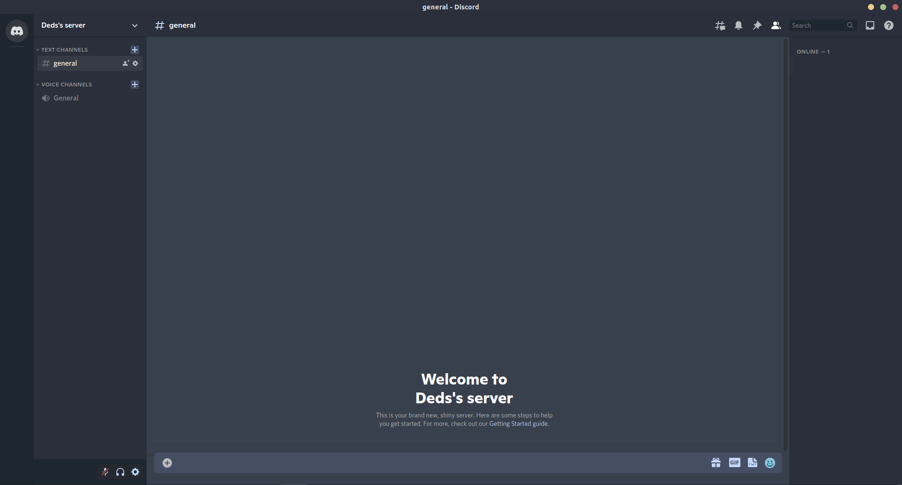

## DarkBlue Ice for customdiscord

### A Beautiful theme for betterdiscord, powercord and aliucord with dark blue and ice colors distributed in a harmonic way.

---

## How to install on betterdiscord
* Download from [github releases](https://github.com/Dedsd/DarkBlue-Ice-for-customdiscord/releases)
* Select the `darkblueice.theme.css` file and move to betterdiscord themes folder
* On Windows:
```
C:\Users\USERNAME\AppData\Roaming\BetterDiscord\themes
```
* On Linux:
```
/home/.config/BetterDiscord/themes
```
* On macOS:
```
/Users/(YourUser)/Library/Preferences/BetterDiscord/themes
```

---

## How to install on powercord

* Go to:
* on Windows:
```
C:\Users\USERNAME\Documents\powercord\src\Powercord\themes
```
* On Linux:
```
/home/powercord/src/Powercord/themes
```

* Clone this repository:
```
git clone git@github.com:Dedsd/DarkBlue-Ice-for-customdiscord.git
```

* If you don't have git you can download the zip from [github releases](https://github.com/Dedsd/DarkBlue-Ice-for-customdiscord/releases) and manually extract and put in the themes folder

---

## How to install on aliucord

* Download from [github releases](https://github.com/Dedsd/DarkBlue-Ice-for-customdiscord/releases)
* Select the `DarkBlue.Ice.json` and move to `Aliucord/Themes`
* With a plugin like themer activate the theme

---

Made by [André V.](https://github.com/Dedsd)

